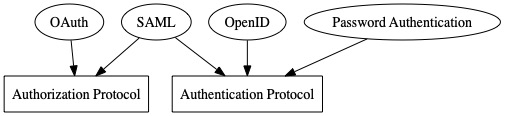

# AuthN & AuthZ
Authentication and Authorization is a big topic in web security. Resources are limited and important, and sometime they are confidential. Authentication and Authorization is the concept to protect your resources from hacking and over usage.

Developers mostly integrate their applications with different Auth providers, like Facebook, Okta, Google etc. Recommended by the industrial practice, developers are not encouraged to code whole AuthN and AuthZ process.  They mainly use some third parties library like, [passport.js](http://www.passportjs.org/). Subsequently, many developers do not understand the story behind the scene. This note will briefly introduce the concept of AuthN and AuthZ and how they are implemented in the current ecology.

## What is AuthN and AuthZ
Authentication(AuthN) and Authorization(AuthZ) are two different concepts but a lot of junior developers will mess up them.

Authentication is a process to prove someone's identity. There is nothing dealing with the resource access. During the authentication process, you will know more background of this person.

Authorization is a process to grant the resource permission to someone or know more about the permission they have to the resources. There may not be a granting process during authorization.

You can imagine this circumstance. You are in a speed dating meeting. When you enter a ball room, you need to show up your VIP invitation. The organizer will try to check if your invitation is valid. If a weirdo uses a fake invitation card, the organizer will try to reject him and find two man in black to give him a lesson. This process is called Authentication.

After you enter the ball room, you will be arranged to a special desk with a full of luxious dishes because of your VIP invitation. You can meet with the VIP girls/boys as well. In this process, the organizer gives you the right to go to the VIP desk because of your identity. This process is Authorization.

Please bear in mind that these two processes are totally different. In the real world, you may need to integrate with different providers in order to perform AuthN and AuthZ separately.

## Common protocols for AuthN and AuthZ

The common protocols for AuthN and AuthZ are listed on the graph above. Because of the different nature in AuthN and AuthZ, most of the protocols will only describe how the developers do the respective action. In general, the developers need to integrate two protocols at once in order to complete both AuthN and AuthZ.

For the details of the protocol, you can find more information in the following link.
* Password Authentication Protocol (PAP) - The most basic protocol to implement the authentication. It is a handy implemnetation but lacks of security
* OAuth - The most well-known protocol for doing the authorization. It has a variety of flows for supporting different situation. But it only provides the way to do the authorization. In the industry, we mainly use OpenID with OAuth to finish the whole AuthN and AuthZ process.
* OpenID - Another common protocol for authentication. It is mainly used with OAuth to do the whole process.
* SAML - XML-based protocol for both AuthN and AuthZ. It always comes with the term Single sign-on (SSO) process.